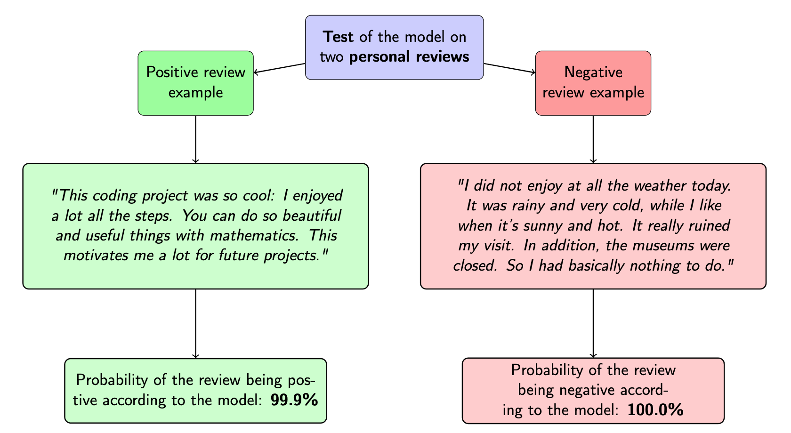

# Deep Learning applications on PyTorch

This repository contains some Deep Learning personal applications, using different methods (CNN, RNN), to solve diverse problems.

## Table Of Contents

### Convolutional Neural Networks (CNN)

* **Image classification**: 
    * In a [first notebook](https://github.com/louischarlot/DeepLearning_Applications_PyTorch/blob/main/CNN/Image_classification_transfer.ipynb), we use **transfer learning** from a pre-trained Residual Neuronal Network (**ResNet**) to classify images from the **STL10** dataset.
We obtain a **94.9%** prediction accuracy (**over the 10 classes**).
    * In a [second notebook](https://github.com/louischarlot/DeepLearning_Applications_PyTorch/blob/main/CNN/Image_classification_implemented.ipynb), we **implement** and train a **ResNet** from scratch, given that the previous pre-trained ResNet is not adapted to the small images of the **CIFAR10** datset we want to classify. We obtain a **84.5%** prediction accuracy (**over the 10 classes**).

*Here are some sample images from the STL10 (left) and CIFAR10 (right) datasets:*

* **Image segmentation**: Work in progress. (U-Net)

* **Face recognition**: Work in progress. (FaceNet, DeepFace)

### Recurrent Neural Networks (RNN)

* **Sentiment analysis**: In [this notebook](https://github.com/louischarlot/DeepLearning_Applications_PyTorch/blob/main/RNN/Sentiment_Analysis.ipynb), we implement a **sentiment analysis** to predict whether the reviews of the [YelpReviewFull dataset](https://pytorch.org/text/stable/datasets.html#yelpreviewfull) are **good**, **neutral**, or **bad**. Our RNN, composed of 2 layers ([Embedding](https://pytorch.org/docs/stable/generated/torch.nn.Embedding.html) and [LSTM](https://pytorch.org/docs/stable/generated/torch.nn.LSTM.html?highlight=lstm#torch.nn.LSTM)), gives a  **80% test accuracy**.
  An additional test,  **on two personal reviews** (one **positive** and one **negative**) that we write on our own, gives the convincing results of the following Figure:

* **Attention networks**: Work in progress.

* **Transformer networks**: Work in progress. 

## Some recommended bibliography

- Heaton, J. (2018). Ian goodfellow, yoshua bengio, and aaron courville: [Deep learning](https://link.springer.com/article/10.1007/s10710-017-9314-z).

- The [CS230 Deep Learning class](https://cs230.stanford.edu/) by Andrew Ng and Kian Katanforoosh.

- [Udacity](https://github.com/udacity/deep-learning-v2-pytorch) very interesting examples on PyTorch.

- [PyTorch official website](https://pytorch.org/), that contains a lot of useful explanations about PyTorch functions.

